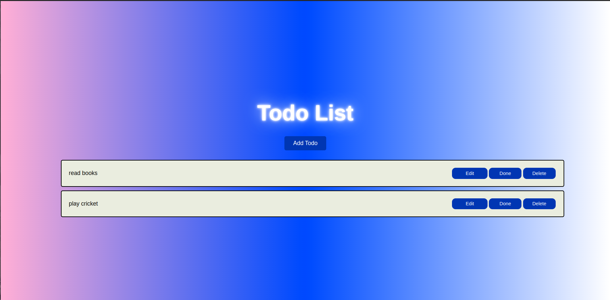
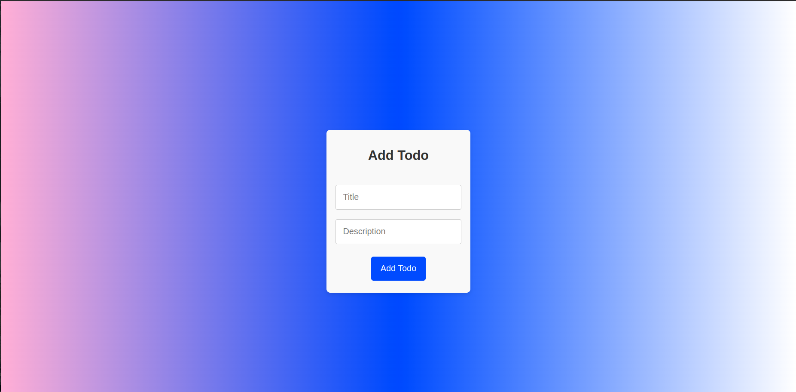
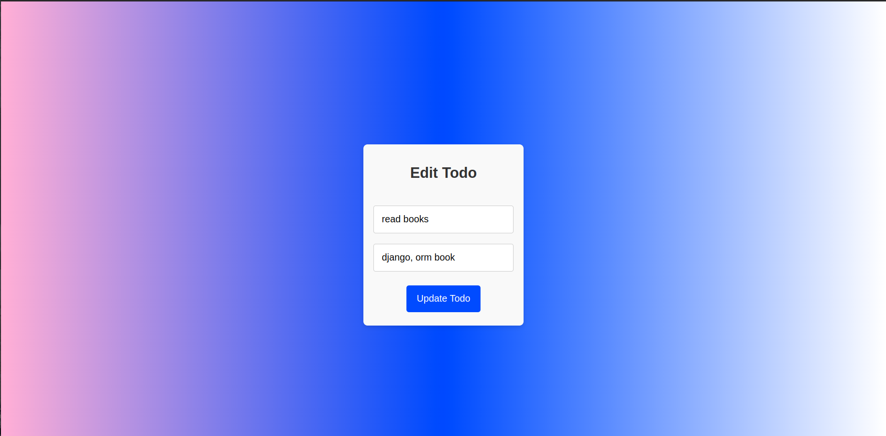
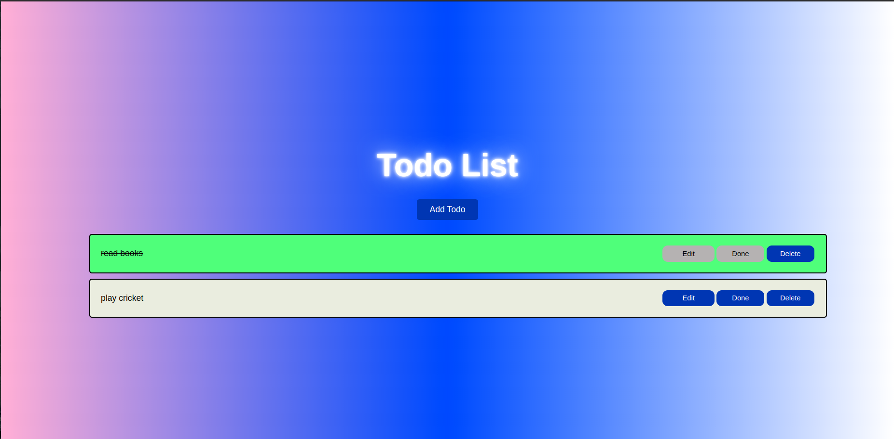

# todo-app
This project is a Todo application built with Django for the backend and React for the frontend. Below are the steps to set up and run the application, along with a screenshot to give you an idea of what to expect.

### Screenshot





### Setup and Run

#### Django Setup

1. **Install Dependencies**: Navigate to the Django project directory and install the required dependencies using pip:
    ```
    pip install -r requirements.txt
    ```
2. **Migrate Database**: Set up the database by running migrations:
    ```
    python manage.py migrate
    ```
3. **Run the Server**: Start the Django development server:
    ```
    python manage.py runserver
    ```
   The Django API will be available at `http://localhost:8000/`.

#### React Setup

1. **Install Dependencies**: Navigate to the React project directory (`todo-front`) and install the required dependencies using npm or yarn:
    ```
    npm install
    ```
    or
    ```
    yarn install
    ```
2. **Start the Development Server**: Run the React development server:
    ```
    npm start
    ```
    or
    ```
    yarn start
    ```
   The React application will be available at `http://localhost:3000/`.

### Usage

After setting up both Django and React, navigate to `http://localhost:3000/` in your browser to use the Todo application. You can add, edit, mark as done, and delete todos.

### Note

Ensure that both the Django and React servers are running simultaneously for the application to work correctly.
